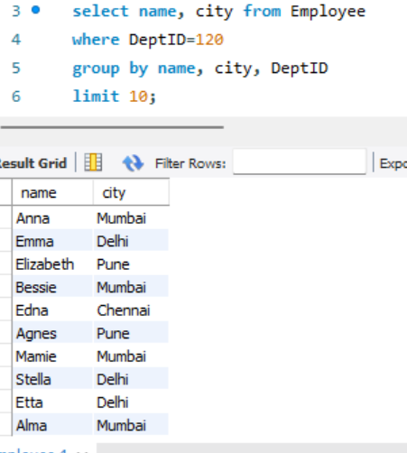
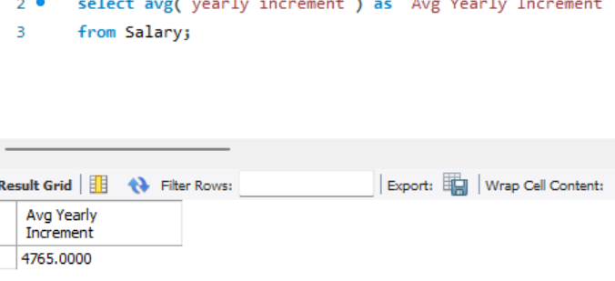
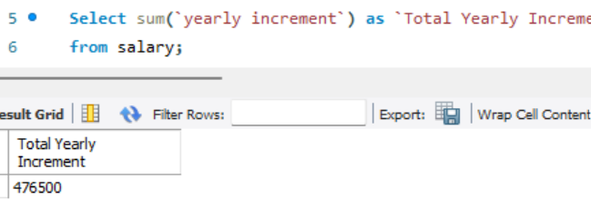
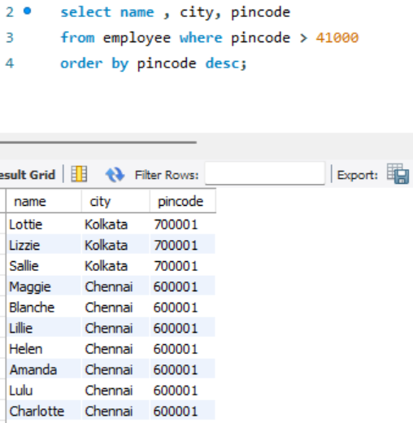

### Introduction to joins and aggregate functions

#### Introduction:
SQL offers a powerful way to generate business questions and effectively uncover valuable insights from data.

In this task, four business questions were ormulated and employed SQL commands such as ORDER BY, GROUP BY, and AGGREGATE FUNCTIONS to obtain valuable insights from the sample_superstore  table.

These commands serve as tools for summarizing and structuring data, enabling easy identification of trends within the business data.

#### Problem Statement:

Come up with 4 business questions and query the tables provided:
Ensure to use the following commands;
- JOINS
- GROUP BY
- At least 2 Aggregate Functions
- ORDER BY.

#### Generated Questions:
1. Show the 10 names and cities where the DeptID is 120
2. Calculate the average profit yearly increment 
3. Calculate the sum of yearly increments
4. Show names, emails, and Pincodes where the pin code is greater than 410000 and displays them in descending order.
5. Join the employee and salary tables having the EmpID as the unique Number

#### Results/Discussion:

The screenshot above shows 10 names and cities where the DeptID is 120 and the syntax used is as follows;

_SELECT Name, City
FROM TableName
WHERE DeptID = 120
GROUP BY (column name)
LIMIT 10;_

This query retrieves a selection of 10 records that include names and cities, grouped by name and city, and specifically for records with a department ID of 120.

This screenshot provided above shows the calculated average yearly profit increment and the syntax used is as follows;

_SELECT AVG(Profit) as `Average Profit Increment`
FROM TableName;_

The snapshot above displays the calculated sum of all the yearly increments and the syntax used is as follows;

_SELECT SUM(Increment) as `Total Yearly Increments`
FROM TableName;_

This snapshot displays the names and cities, then filters the result to include only pin codes that are gretaer than 41,000, and arranges the results in descending order. The syntax used is as follows;

_SELECT Name, City
FROM TableName
WHERE PinCode > 41000
ORDER BY PinCode DESC;_

#### Conclusion:

this task has highlighted the remarkable potential of SQL in facilitating business queries.

Through a series of business questions and the use of SQL commands like ORDER BY, GROUP BY, and AGGREGATE FUNCTIONS, valuable insights were obtained that would help in decision-making within a business context.
